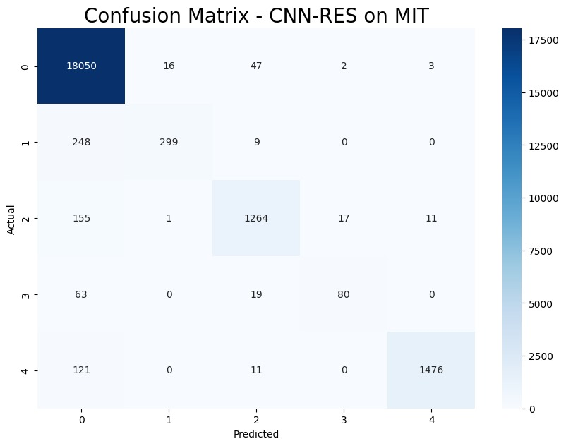
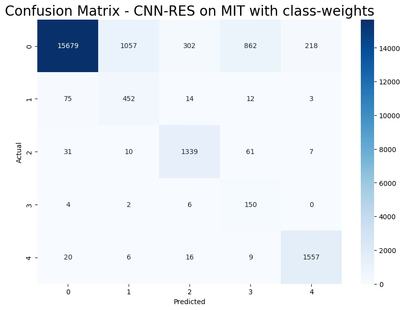

## Pneumonia Prediction Dataset

### Supervised Model for Transfer
We use our simple Residual CNN from part 1. It achieved strong performance on the PTB Diagnostic dataset with a very low parameter count, making it suitable for the self-supervised learning task in question 2. We train it for 5 epochs (and we will continue to train for 5 epochs across all experiments on the MIT-BIH dataset for fairness). We report the performance from straightforward training. Additionally, we provide the performance obtained when class weights are considered in the loss function. In other words, we use the proportion of each class in the dataset to weigh the loss.

#### Performance Metrics

| **Accuracy** | **F1** | Precision - weighted | Precision - macro | Recall - macro | **OVR** |
|--------------|--------|----------------------|-------------------|----------------|---------|
| **0.97**     | **0.96** | **0.97**            | **0.93**          | 0.76           | **0.97**|
| 0.88         | 0.90   | 0.95                 | 0.62              | **0.90**       | **0.98**|

#### Figures

