## Supervised Learning on Time Series

### Exploratory Data Analysis
The PTB dataset consists of 14,552 observations of ECG signals with a maximum length of 187. All sequences had already been padded to this maximum length. There is a mild class imbalance with the healthy labels making up around 27% of the data. The distribution of the labels and sequence lengths without padding can be seen in Figure \ref{fig:t1-distr}. Example ECG time series of the two different classes can be seen in Figure \ref{fig:t1-example_TS}. From this figure, we see that healthy ECGs all follow a very similar pattern with distinguishable waves, while the abnormal examples can vary strongly.

For the classification task, we follow \cite{premanand2021tree} and report both accuracy and F1 score as well as the confusion matrix and ROC curve. We believe these metrics would provide a comprehensive evaluation of the model's performance, allowing us to assess not only overall accuracy but also the balance between precision and recall, the distribution of predictions across classes, and the model's ability to distinguish between positive and negative instances.

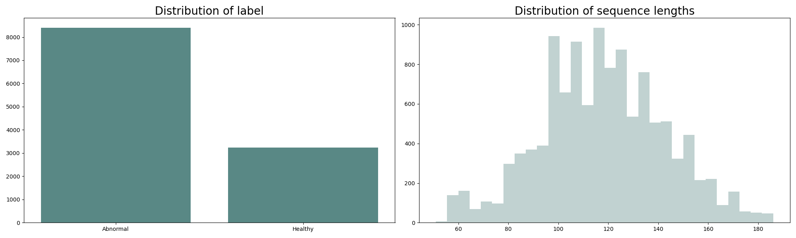
*Figure 1: Distribution of the label and sequence lengths*

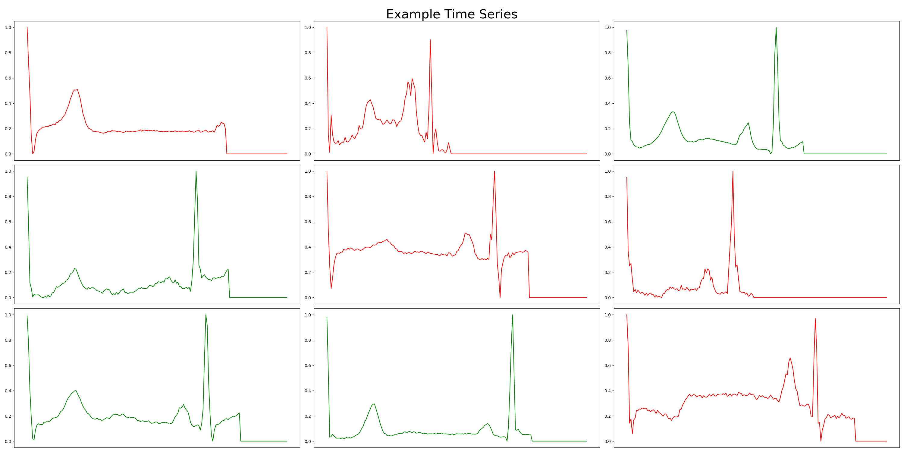
*Figure 2: Examples for healthy (green) and abnormal (red) ECGs*

### Classic Machine Learning Methods

We follow \cite{premanand2021tree} and choose to train the following classic ML classifiers: logistic regression, Random Forest, and Extreme Gradient Boosting (XGBoost). We selected the latter two ensemble methods as they have demonstrated among the best performance in \cite{premanand2021tree}. We did not apply SMOTE to account for the imbalance as suggested by the authors, to ensure comparability across the tasks. Our results are very similar to the author’s results, who also report performance on the Database without using SMOTE. The test set performance metrics are shown in Table \ref{table:model_performance} along with the confusion matrix and ROC curves. We find that Random Forest and XGBoost outperform logistic regression. As expected, the flexibility of the tree-based methods allow them to outperform the regression-based method, as shown in the table.

#### Performance of Different Models

| Model               | Accuracy | Precision | Recall | F1-Score | AUC  |
|---------------------|----------|-----------|--------|----------|------|
| Logistic Regression | 0.82     | 0.85      | 0.92   | 0.88     | 0.88 |
| Random Forest       | 0.97     | 0.97      | 0.99   | 0.98     | 0.99 |
| XGBoost             | 0.98     | 0.99      | 0.99   | 0.99     | 1.00 |

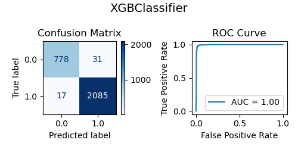
*Figure 5: Confusion matrix and ROC curve for XBoosting*

Next, we used the tsfresh package \cite{oord2019representation} to create new features for our time series analysis. Using the package, we avoid elaborate manual feature crafting as it allows us not only to create but also to identify relevant features. We essentially replace non-finite values, filter out irrelevant features and select columns that possess enough variability. Note that this significantly reduces the set of features from 783 to 453. Subsequently, we redo the classification with our previously chosen methods. The test set performance of all models is shown in Table \ref{table:model_performance_additional_features}. As one would expect, this strongly improved the accuracy of the logistic regression, which increased from 0.82 to 0.94. Additionally, we report the confusion matrix and ROC Curve again for completeness. To reveal which of the newly created features by tsfresh are important for the models, we present the feature importance in the Appendix.

#### Performance of Different Models with Additional Features

| Model               | Accuracy | Precision | Recall | F1-Score | AUC  |
|---------------------|----------|-----------|--------|----------|------|
| Logistic Regression | 0.94     | 0.95      | 0.96   | 0.96     | 0.98 |
| Random Forest       | 0.97     | 0.97      | 1.00   | 0.98     | 0.99 |
| XGBoost             | 0.99     | 0.99      | 0.99   | 0.99     | 1.00 |

Finally, we review the chosen classifiers. This comparison essentially boils down to weighing the benefits of generalized linear models against tree-based models. On one hand, logistic regression models are simple to understand, efficient to train, and less prone to overfitting. On the other hand, they assume a linear relationship between the features and the log odds of the dependent variable, which might not be suitable for complex relationships. Fortunately, tree-based approaches can be advantageous in settings with complex relationships between features and the response. In \cite{james2013introduction}, they identify the following pros and cons of decision trees:

#### Pros
- Easy to explain to people as they mimic human decision making.
- A tree can be represented graphically.

#### Cons
- Non-aggregated decision trees have rather low predictive performance.

But more importantly, unlike regressions, which have low variance, regression trees suffer from high variance. Bootstrapping helps to overcome this drawback, which is why we chose ensemble learning methods. As pointed out in \cite{james2013introduction}, averaging individual trees with low bias but high variance helps to reduce variance. Additionally, Random Forest considers only a subset of predictors at each split, reducing the risk that most bagged trees will rely on the same strong predictors. Besides the bagging approach, we also consider the sequential growth of trees to gradually improve the model in areas with low performance. Such boosting models tend to deliver better performance and enhance the interpretability of the model due to their smaller size.

### Convolutional Neural Networks
RNNs and CNNs both offer distinct advantages for time series tasks. 

RNNs are designed to process temporal information by reusing the activations of previous nodes for the next output. This recurrent connection allows RNNs to maintain a memory of previous inputs, which is crucial for capturing temporal dependencies in time series data. They excel in tasks where the order and context of data points are important, such as language modeling or sequential predictions.

On the other hand, CNNs are ideal for extracting local features and can be applied to any kind of data where neighboring information is relevant. They are very effective at recognizing patterns and are equivariant to translations on the input sequence, meaning they can detect patterns regardless of their position in the sequence. This characteristic is particularly useful for time series where patterns may shift over time. Additionally, CNNs typically scale better with sequence length and are more stable during training compared to RNNs. They can efficiently process long sequences using techniques like dilated convolutions to capture long-range dependencies without the vanishing gradient issues often encountered in RNNs.

We trained a vanilla 3-layer

 CNN with batch normalization and ReLU activation after every convolutional layer and a classification head to predict the corresponding class. We report a test set performance of 0.977 accuracy and 0.984 F1 score. The confusion matrix and receiver operating characteristic curve can be seen in Figure \ref{fig:CNN}.

For the residual CNN we added a residual connection after the second convolutional layer but kept the rest of the architecture identical for a more fair comparison. This implementation achieves a test set performance of 0.985 accuracy and 0.990 F1 score. The confusion matrix and receiver operating characteristic curve can be seen in Figure \ref{fig:CNN_res}. We conclude that the addition of a residual connection in the architecture led to an improvement in performance. This is consistent with \cite{he2016deep}, who demonstrated that residual connections can help solve the issue of vanishing gradients, thereby improving efficient learning. Residual layers enable gradients to flow more effectively through the network during backpropagation, preventing the degradation of gradient signals in deep networks. However, it is important to note that while residual connections generally enhance performance, their impact can be context-dependent. For shallower networks or certain types of tasks, the benefits might be less pronounced.

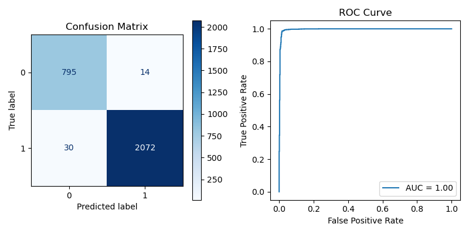
*Figure 12: Confusion matrix and ROC curve for the residual CNN model*

### Attention and Transformers
We trained a 2-layer transformer with hidden size 128, 2 heads per layer and a classification head to predict the corresponding class. We report a test set performance of 0.966 accuracy and 0.961 F1 score. The confusion matrix and receiver operating characteristic curve can be seen in Figure \ref{fig:Transformer}.

Unlike RNNs, Transformers do not require sequential processing of the data. This enables parallel processing, which can significantly speed up training. The self-attention mechanism in Transformers allows them to capture long-range dependencies in the input sequence, a task that RNNs typically struggle with. Additionally, this attention mechanism can be leveraged for interpretability, enabling analysis of which parts of the input sequence the model is focusing on. However, Transformers have higher computational complexity, making them more expensive to train. They also generally require a much larger amount of data to train effectively.

In Figure \ref{fig:t1-attention} we have visualized the attention map by averaging over the heads, performing attention rollout \cite{attention_rollout} across layers and finally averaging across the sequence to get a single value per time-step. We can see that the model has learned to highly focuses on the R-wave of the ECG signal. Moreover, the PR interval also seems to be relatively relevant to the model.

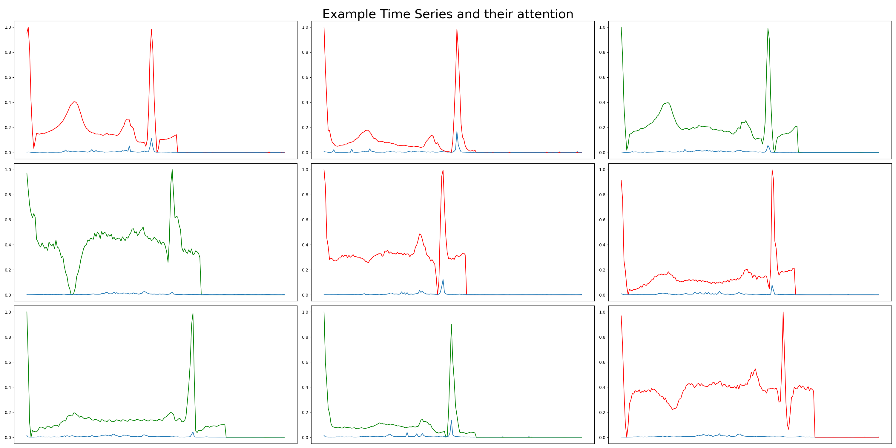
*Figure 14: Examples for healthy (green) and abnormal (red) ECGs with the corresponding attention (blue)*

## Pneumonia Prediction Dataset

### Supervised Model for Transfer
We use our simple Residual CNN from part 1. It achieved strong performance on the PTB Diagnostic dataset with a very low parameter count, making it suitable for the self-supervised learning task in question 2. We train it for 5 epochs (and we will continue to train for 5 epochs across all experiments on the MIT-BIH dataset for fairness). We report the performance from straightforward training. Additionally, we provide the performance obtained when class weights are considered in the loss function. In other words, we use the proportion of each class in the dataset to weigh the loss.

#### Performance Metrics

| **Accuracy** | **F1** | Precision - weighted | Precision - macro | Recall - macro | **OVR** |
|--------------|--------|----------------------|-------------------|----------------|---------|
| **0.97**     | **0.96** | **0.97**            | **0.93**          | 0.76           | **0.97**|
| 0.88         | 0.90   | 0.95                 | 0.62              | **0.90**       | **0.98**|

#### Figures
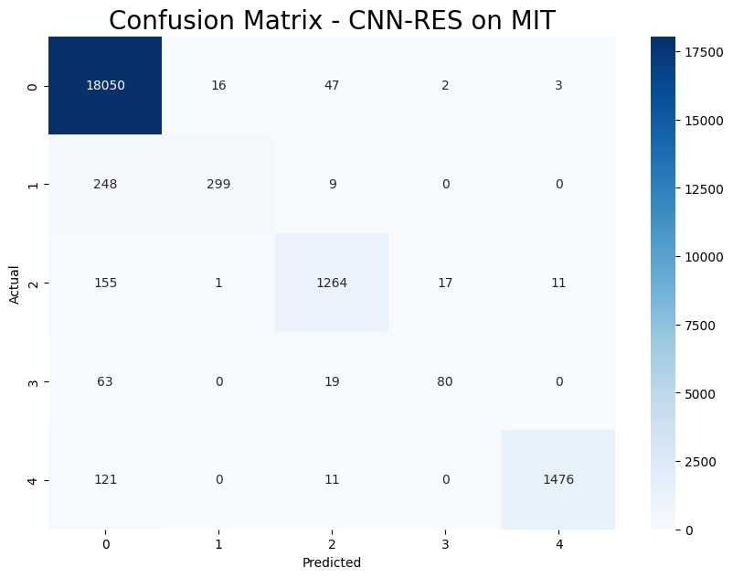
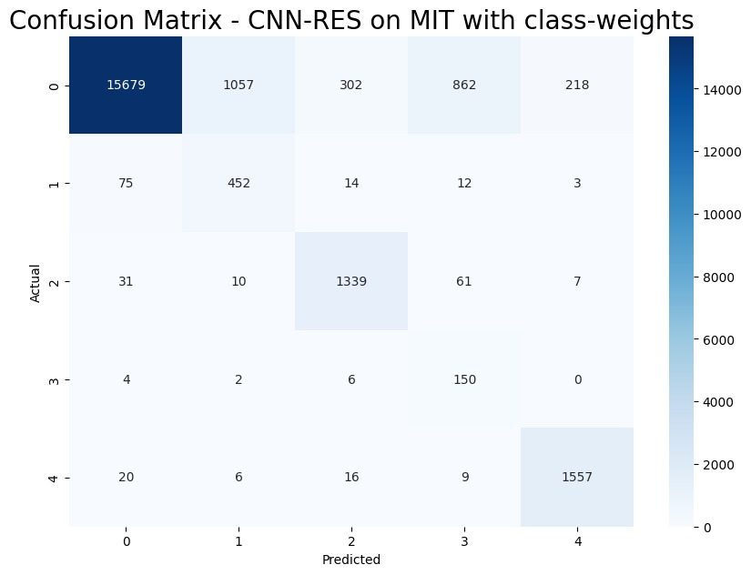

We choose to report both accuracy and F1 score. Accuracy provides a good measure of the overall performance of our model, while F1 score is essential given the heavily imbalanced nature of our dataset, as discussed in the previous task. We note that high accuracy could be misleadingly achieved by predominantly classifying samples as '0', which is not desirable. We further break down our F1 score by showing precision and recall. We believe it is crucial to have this breakdown in medical settings where sensitivity, for instance, can be of paramount importance and a design choice to favor it even at the cost of overall accuracy. For Precision and Recall, we show not only the sample-weighted values (note that a weighted recall is equal to accuracy - hence why it is not shown in the above tab) but also the macro values (not normalized by class-weight in the dataset) to further highlight that classification performance is imbalanced across classes, as a result of the dataset imbalance. Finally, we report OVR to get a sense of the informativeness of our model's predictions.

We note a large drop in overall performance when switching to balanced training. This drop should be considered in the context that the task to train in a balanced way is more challenging and thus requires more epochs. Additionally, it is evident from the confusion matrix that the drop is due to the large number of samples from class 0. We tested with twice the amount of training epoch and even though we did reach the performances of unbalanced training on accuracy/F1, it was much closer. Nonetheless, we choose to stick with the 5-epoch tests and report some metrics here in the balanced setting to illustrate that design choices can easily be made based on different priorities.

### Representation Learning Model
We choose to code, from scratch, the InfoNCE approach /cite{oord2019representation}. We design a custom Dataset class, a custom Contrastive Predicting Coding (CPC) model, and an InfoNCE loss adapted to our problem. We optimize the code for performance and make the following architectural choices:
- We reuse the exact ResnetCNN from Q1 as our encoder,
- We use the PyTorch-implemented GRU /cite{pytorchGRU} as our autoregressive model,
- We use a chunk size of 60 and ensure that the chosen chunks fall before the 0-padded regions of our time series (or at the beginning for the few series that are too short),
- We use 8 negatives per positive.

We choose a batch-size of 2048 and train for one epoch across the whole training set.

We explored various methods to monitor the pre-training step, balancing the need to maintain the integrity of unsupervised training by avoiding the use of labels with the need for effective monitoring. One option is monitoring the loss of the encoder. However, we do not wish to overly rely on it as contrastive learning can be tricky to tune and a decreasing loss is not always linked to actual informative representations learned by the encoder. We choose not to use cluster metrics at this stage, as they can be misleading in high-dimensional and multi-class settings. Even separable classes may form complex, multi-cluster shapes that clustering metrics might fail to evaluate accurately without labels. Instead, we employ visualization techniques such as t-SNE or UMAP to qualitatively assess the structure of the learned representations. It is also useful to monitor training stability to prevent issues such as exploding or vanishing gradients.
While our primary approach avoids using labels, it is common practice to include a small number of labeled samples for more effective monitoring. This can make the low-dimensional plots of representations more informative and provide a practical compromise for evaluating the pre-training progress.

We choose to use t-SNE as a visualization tool for our latent space without labels at different points during training. To monitor training, we observe the InfoNCE loss and look for instability. After observing a smooth decrease in loss and increasingly-structured latent spaces, we decided that the training was satisfactory and moved to the next phase.

We then train an XGB model with 100 trees to classify the representations from our encoder into five classes. We obtain the following metrics and confusion matrix on the test set using this XGB predictor:

#### Performance Metrics

| **Accuracy** | **F1** | Precision - weighted | Precision - macro | Recall - macro | **OVR** |
|--------------|--------|----------------------|-------------------|----------------|---------|
| 0.98         | 0.98   | 0.98                 | 0.96              | 0.86           | 0.99    |

#### Figure
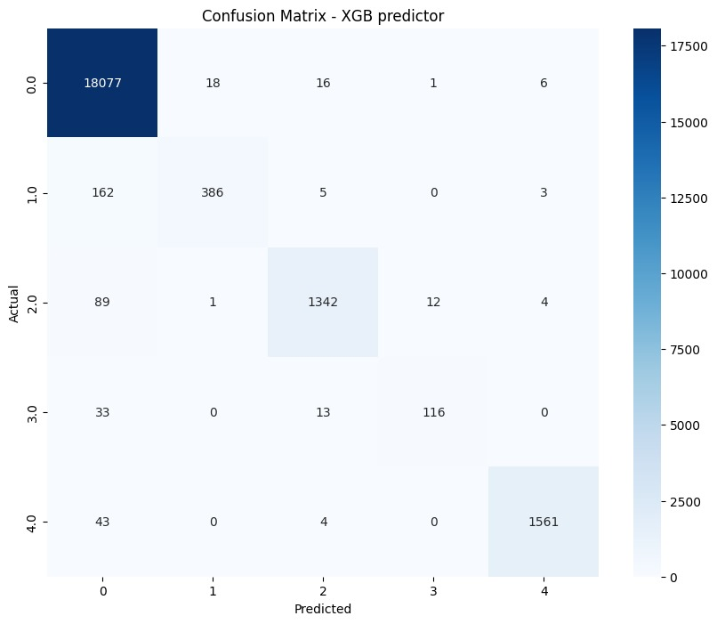

These metrics are quite spectacular and show that our XGB algorithm using these representations vastly outperforms our first ResnetCNN+MLP predictor. The representations learnt in an unsupervised way seem to be very informative and allow the XGB to then use the labels much more efficiently.

### Visualising Learned Representations
We begin with the MIT-BIH dataset as our encoders were trained on this data. We then move on to the PTB dataset to show transfer learning potential. We use t-SNE as a visualization tool and report both 2D and 3D projections. For quantitative metrics, we report JS divergences to compare label distribution within a given latent space and Wasserstein distance to compare between different latent spaces. We choose JS divergence over the KL divergence as distribution support is not reliable in this discrete setting and because we want a symmetric measure in our multi-class setting. The reported metrics are averages over all labels.

#### MIT-BIH dataset

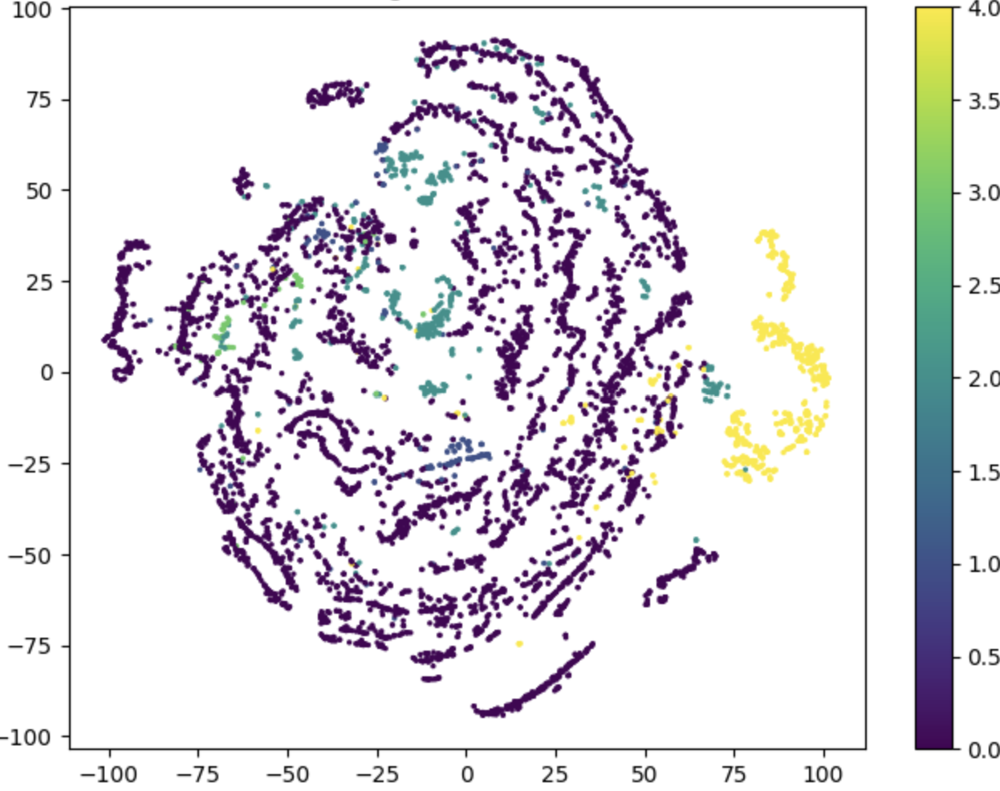
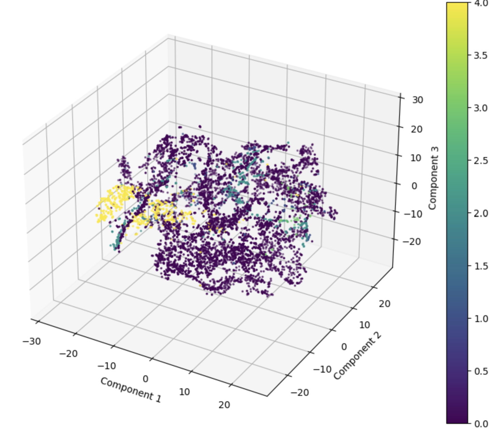
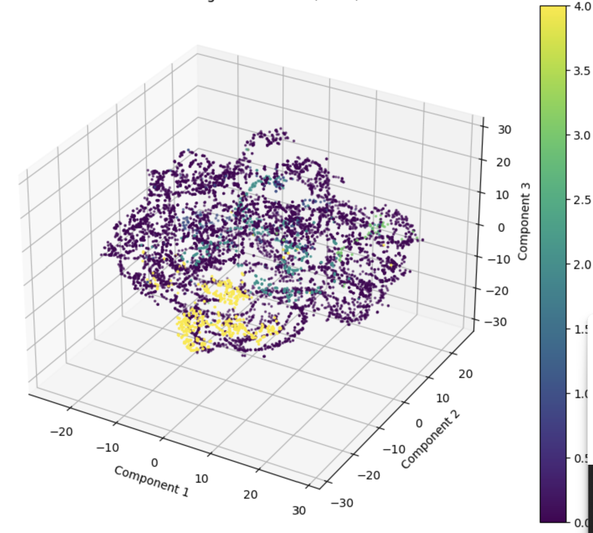

We can clearly see some important similarities between the two latent spaces. The yellow cluster (corresponding to label 4) has the same structure in both, and label 2 also creates some clean clusters across the latent space. For both encoders, label 0 leads to many structures across the latent space, which partially explains, in addition to the data imbalance, why there is confusion and classifiers tend to predict label 0 too often: all samples in the latent space are somewhat close to a cluster from label 0. 

The obvious difference between the two latent spaces is of course the overall structure. The supervised-learned one is more ordered, cleaner, with concentric circles and overall more distinct clusters, which will probably translate to better performance with the same classifier on top in Q4.

#### Quantitative metrics - MIT-BIH

| **JS Div - unsupervised** | **JS Div - supervised** | **Wasserstein Distance** |
|---------------------------|-------------------------|--------------------------|
| 0.007                     | 0.003                   | 0.02                     |

We will comment on these numbers after comparing them with the PTB dataset, since on their own, without units they do not mean much yet. We can just note that the data points are overall closer in the supervised-learned latent space (0.003 vs 0.007 mean distance between labels), which is a bit counter-intuitive but shows that separability in the latent space is not always linked to further-apart representations of different labels. The space is just used more efficiently.

#### PTB Dataset
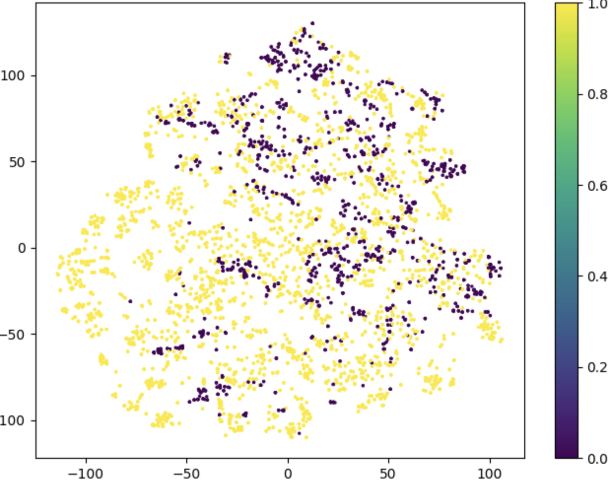
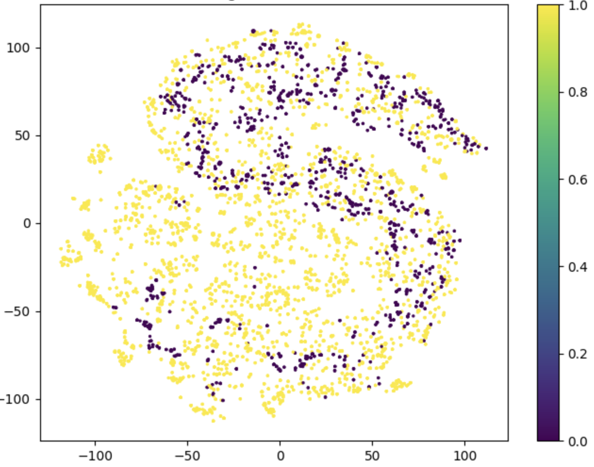
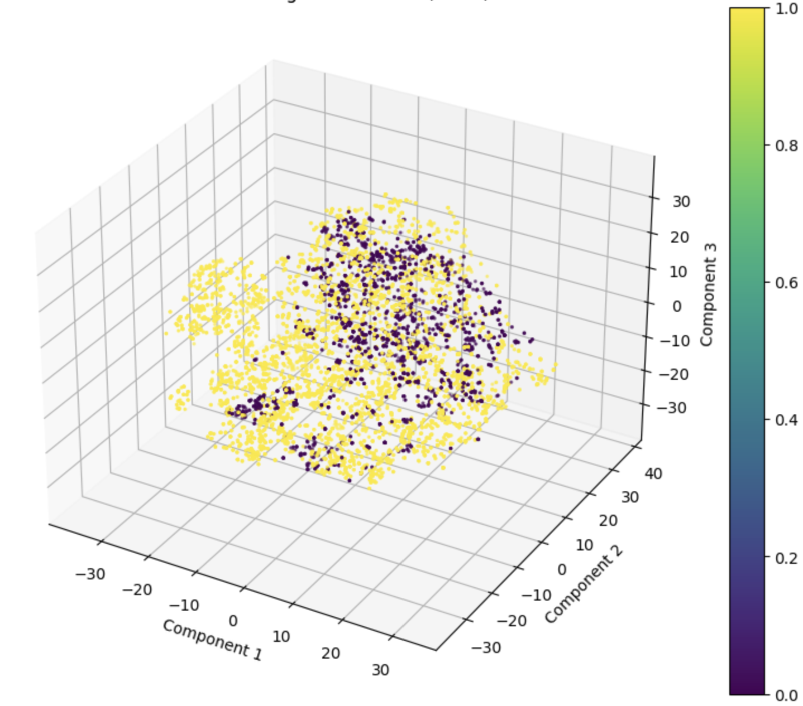
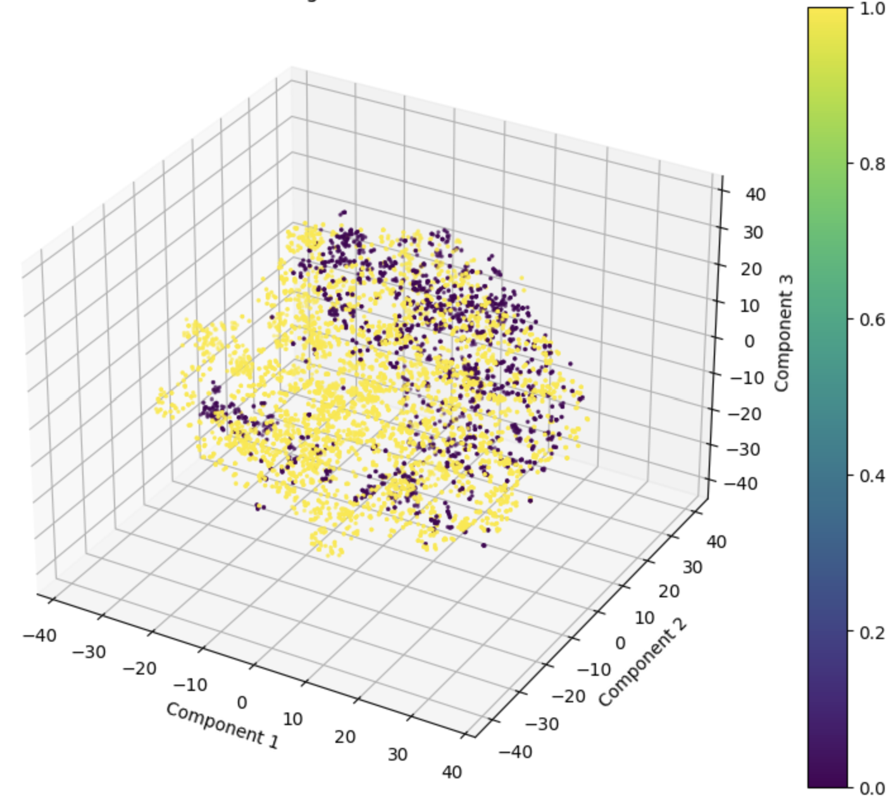

This time the latent spaces are a bit less structured overall and the points seem less separable than before. This can be explained by the fact that our encoders have never seen this data; this is pure transfer capability. Despite that, we can note two things:
- On the 3D projection some structure emerges. The 2D projection might not shed light on the quality of the latent spaces, and across both spaces, the two labels seem somewhat separated,
- Again, the supervised-learned encoder has more structure, with a kind of S-like shape in the 2D projection.

#### Quantitative metrics - PTB

| **JS Div - unsupervised** | **JS Div - supervised** | **Wasserstein Distance** |
|---------------------------|-------------------------|--------------------------|
| 0.003                     | 0.002                   | 0.02                     |

This time, as expected, the in-space distance between labels on the projection is much more similar between the two encoders.

We can now comment on the Wasserstein Distance: it is the same in both datasets meaning

 that for both problems the overall distance between the distributions generated by the two encoders is the same. This partially suggests that they have the same relative quality in both problems and we can expect similar performance gaps across the two datasets later in this project.

We can also already comment on the better performance of the supervised-learned encoder. Its loss directly forces the overall model to discriminate between labels. To achieve this, the prediction-module (MLP here) needs to have a separable space and thus the encoder has to create this space, leading to overall cleaner structures. The self-supervised approach is completely different in that we build a "fake" supervised task (here, predicting the next latent representations of the time-series) hoping that succeeding at this task implies that the encoder needs to separate labels in the latent space. However, there is no explicit knowledge of labels, only raw data and its underlying specifics, and all the other modules (projectors, aggregators) are also trained to succeed at the prediction task even though we do not keep them. We thus only get some collateral benefits from succeeding at the self-supervised task leading to a somewhat worse encoder. The strength of this approach is, of course, that we could train with much more data since it needs not be labeled, but it is beyond the scope of this project.

### Finetuning Strategies
We test the best transfer-learning strategies after training two encoders on the large MIT-BIH dataset. We first use an XGB comprised of a hundred trees and train it on the representations for the PTB dataset of our two encoders in a supervised fashion. Then, we explore ways to use an MLP as the predictor on top of our encoders. In all experiments, we use the same MLP as during the rest of this project, i.e a two-layers MLP projecting the representations onto 256 features, before projecting again onto the prediction-space (1 number for this binary dataset).

We use the following notation in the table below:
- u, s respectively mean unsupervised, supervised to precise the way the encoder was trained,
- after the "+" is the prediction head used after the encoder,
- frozen encoder means that the prediction head is trained while the parameters of the encoder remain unchanged (irrelevant for XGB),
- retrain all means that the whole architecture (encoder and prediction head) are trained, which is the second training phase for the encoder,
- 5 frozen, 5 all means that we train only the prediction head for 5 epochs, then the whole stack for 5 more.

When training a deep learning approach, we always use 10 epochs in total and a batch-size of 256 for this fine-tuning step. We report the same metrics as in Q1 and Q2 for all approaches in the following table.

#### Transfer-learning study - PTB dataset

| **Approach**               | **Accuracy** | **F1** | Precision - w | Precision - m | **ROC-AUC** |
|----------------------------|--------------|--------|----------------|----------------|--------------|
| **u+XGB**                  | 0.98         | 0.98   | 0.98           | 0.98           | 0.97         |
| **s+XGB**                  | 0.99         | 0.99   | 0.99           | 0.99           | 0.98         |
| **u+MLP, frozen encoder**  | 0.92         | 0.92   | 0.92           | 0.89           | 0.92         |
| **s+MLP, frozen encoder**  | 0.98         | 0.98   | 0.98           | 0.98           | 0.97         |
| **u+MLP, retrain all**     | 0.98         | 0.98   | 0.98           | 0.98           | 0.98         |
| **s+MLP, retrain all**     | 0.99         | 0.99   | 0.99           | 0.99           | 0.99         |
| **u+MLP, 5 frozen 5 all**  | 0.97         | 0.97   | 0.97           | 0.96           | 0.96         |
| **s+MLP, 5 frozen 5 all**  | 0.99         | 0.99   | 0.99           | 0.99           | 0.98         |

The best performances for both types of encoder were obtained with a full retraining of 10 epochs using an MLP head. This approach is, however, the most costly way of doing things, so it makes sense: the encoders can be slightly adjusted to extract the right features for the new dataset from the ones they know, and the head learns jointly to use these features. The benefits are marginal since almost all techniques reach near-maximum metrics. The exception is the u+MLP frozen encoder approach, where performances are quite a bit poorer. This also makes sense since features were learned on another dataset without the explicit goal of discriminating between labels, and the encoder is used as is. The MLP is not powerful enough over 10 epochs to learn to use these sub-optimal features as well as the XGB. Transfer learning seems to have been the most efficient approach for this problem by a small margin. This can be expected since it trains the encoder more extensively than representation learning, allowing it to adapt to the slight particularities of the new dataset while leveraging the known specifics of the modality at hand.

We can also note that the s-encoder always outperforms the u-encoder, which again was to be expected. However, the advantage is marginal, and the performances in transfer with the u-encoder are very good, considering that we only need the labels for the small dataset with these approaches. They are thus probably the most cost-efficient by a significant margin.

Finally, it should be noted that the XGB head performs exceptionally well, only losing out to the best approach by 1 point in AUC. This confirms that traditional ML approaches are still relevant and state-of-the-art as predictors. Their only downside is their inefficiency in extracting features.

Overall, a very efficient approach to these kinds of problems is to use self-supervised pre-training on a large dataset to learn to extract informative features, followed by a classic ML approach to predict from these features.